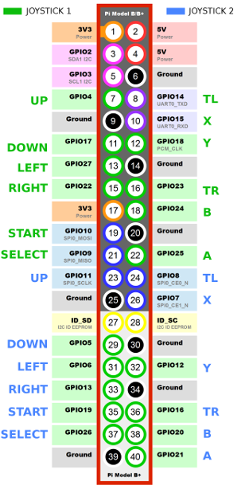

# am_joyin
Amos Joystick Input Driver for Raspbrri-pie Arcade 

나는 이 드라이버 개발 과정에서 mk_arcade_joystick_rpi를 참고했다.
주요한 로직의 일부를 차용했고, 의도적으로 핀맵의 호환성을 유지하려 노력했다.

> ***NOTE***: 
> mk_arcade_joystick_rpi 프로젝트 사이트 : https://github.com/recalbox/mk_arcade_joystick_rpi


**키워드 설명**

| 키워드    |   설명                                                         | 최대 갯수          |
|----------|----------------------------------------------------------------|-------------------|
| keyset   | 라즈베리파이에서 인식하는 입력 정보의 집합                        | 개본 1개 + 최대 2개 |
| endpoint | 라즈베리파이에서 액세스 할 단위. /dev/input/js#의 형태로 생성된다. | 최대 4개           |
| device   | 입출력을 실제로 처리할 장치                                      | 최대 4개           |


**실행 방법**

```shell
sudo modprobe am_joyin
```

**파라미터 포맷**


**GPIO 입력**



```shell
sudo modprobe am_joyin device1="gpio;;0,default1,default"
```

```shell
sudo modprobe am_joyin endpoints="default,12;default,12" device1="gpio;;0,default1,12;1,default2,12"
```


**74HC165 입력**

```shell
sudo modprobe am_joyin device1="74hc165;16,20,21,,1;0,default,default"
```

**MCP23017 입력**

```shell
sudo modprobe am_joyin device1="mcp23017;0x20;0,default,default"
```


**Multiplexer(=MUX) 입력**

```shell
sudo modprobe am_joyin device1="mux;26,19,13,6,,5,default;0,default,default"
```


> ***NOTE***
> 이것은 라즈베리파이3B, 라즈베리파이3B+, 라즈베리파이4B에서 테스트 되었다.
> 그 이의 기종에 대한 동작은 보증하지 못 한다.
