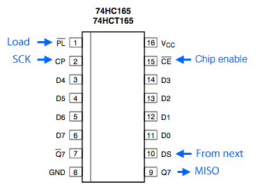

# am_joyin

---

Amos Joystick Input Driver for Raspbrri-pi Arcade (or another SBC)

이것은 라즈베리파이를 이용하여 아케이드 게임기를 제작할 때 다양한 입력장치를 사용할 수 있도록 기획되고 제작되었다.

기본적으로 GPIO를 통해 조이스틱을 입력 받거나, 74HC165, MUX, MCP23017 등의 IO 확장 보드 등을 지원한다.

게임기를 제작하는 과정에서 다양한 형태의 입력 장치를 사용할 수 있고, 또한 이런 장치들의 조합 역시 다양할 수 있기에, 무엇보다 확장성과 유연성이 중점을 두고 설계되었다.

나는 이 드라이버 개발 과정에서 mk_arcade_joystick_rpi를 참고했다. 주요한 로직의 일부를 차용했으며, 기존에 mk_arcade_joystick_rpi의 사용자들의 편의를 위해 의도적으로 GPIO 핀맵의 호환성을 유지하려 노력했다.

> ***NOTE:***\
> mk_arcade_joystick_rpi 프로젝트 사이트 : https://github.com/recalbox/mk_arcade_joystick_rpi


**키워드 설명**

| 키워드     |   설명                                                         | 최대 갯수          |
|-----------|----------------------------------------------------------------|-------------------|
| buttonset | 라즈베리파이에서 인식하는 입력 정보의 집합                        | 기본 1개 + 최대 2개 |
| endpoint  | 라즈베리파이에서 액세스 할 단위. /dev/input/js#의 형태로 생성된다. | 최대 4개           |
| device    | 입출력을 실제로 처리할 장치                                      | 최대 4개           |


**버튼셋**

커스텀 버튼에서 사용하는 코드는 input-event-codes.h 파일을 참고하면 된다.

[input-event-codes.h](extra/input-event-codes.h)

기본 제공 버튼셋 (buttonset id = 0)

| 키코드       | 코드  | 최소값 | 최대값 |
|-------------|-------|--------|-------|
| ABS_Y       | 0x01  | -100   | 100   |
| ABS_X       | 0x00  | -100   | 100   |
| BTN_START   | 0x13B | 0      | 1     |
| BTN_SELECT  | 0x13A | 0      | 1     |
| BTN_A       | 0x130 | 0      | 1     |
| BTN_B       | 0x131 | 0      | 1     |
| BTN_X       | 0x133 | 0      | 1     |
| BTN_Y       | 0x134 | 0      | 1     |
| BTN_TL      | 0x136 | 0      | 1     |
| BTN_TR      | 0x137 | 0      | 1     |
| BTN_MODE    | 0x13C | 0      | 1     |
| BTN_TL2     | 0x138 | 0      | 1     |
| BTN_TR2     | 0x139 | 0      | 1     |
| BTN_TRIGGER | 0x120 | 0      | 1     |


## 드라이버 설치

### 0. 사전 작업 및 개발 환경 구축

먼저 사전 작업으로 2가지를 해야 한다.

> 1. wifi 연결 및 ssh 활성화
> 2. 라즈베리파이에 ssh로 접속합니다.
> 3. 만약 mk_arcade_joystick_rpi 드라이버가 설치되어 있다면 제거 :
>    * retropie 설정 메뉴에서 retropie-setup으로 들어가, 드라이버 항목에서 mk_arcade_joystick_rpi 를 제거한다.
>    * shell에서 sudo ~/RetroPie-Setup/retropie_setup.sh 를 실행하여, 드라이버 항목에서 mk_arcade_joystick_rpi 를 제거한다.


다음으로는 드라이버 빌드를 위한 환경을 구축한다.

**1. 패키지 업데이트**

```shell
sudo apt update
```

**2. 개발툴 설치**

```shell
sudo apt install -y --force-yes dkms cpp-4.7 gcc-4.7 git joystick
```

**3. 커널 헤더 설치**

```shell
sudo apt install -y --force-yes raspberrypi-kernel-headers
```


### 1. am_joyin 드라이버 설치

사전 작업이 마무리 되었다면 본격적으로 설치 작업을 진행한다.

#### wget 사용시

```shell
wget https://github.com/amos42/am_joyin/releases/download/v0.1.0-alpha03/am_joyin-0.1.0.deb
sudo dpkg -i am_joyin-0.1.0.deb
```

#### git 사용시

1. 드라이버 소스를 받는다.

```shell
git clone https://github.com/amos42/am_joyin.git
```

2. deb 패키지를 생성 후 설치한다.

```shell
cd am_joyin
./utils/makepackage.sh 0.1.0 
sudo dpkg -i build/am_joyin-0.1.0.deb
```
​
이 과정까지 거치면 드라이버 설치가 1차적으로 완료된다.


### 3. am_joyin 설정

다음으로는 드라이버 설정을 진행한다.

> ***NOTE:***\
> am_joyin 설정 파일 위치 : /etc/modprobe.d/am_joyin.conf

텍스트 에디터로 설정 파일을 연다.

```shell
sudo nano /etc/modprobe.d/am_joyin.conf
```

GPIO를 이용한 1P 입력 장치를 적용하고 싶다면 다음과 같이 입력하고 ctrl-x를 눌러 저장하고 종료한다.

```
options am_joyin device1="gpio;;0,default1"
```

> ***NOTE:***\
> 만약 이 과정을 생략하고 am_joyin 설정을 누락시키면 am_joyin은 기본 default 파라미터로 동작한다.\
> 이는 mk_arcade_joystick_rpio map=1과 같은 동작을 재현한다.


### 4. 드라이버 부팅시 자동 로딩

다음은 전원을 켤 때마다 자동으로 am_joyin 드라이버가 로딩되도록 하기 위한 과정이다.

드라이버 모듈 설정 파일을 연다.

```shell
sudo nano /etc/modules-load.d/modules.conf
```

마지막 라인에 다음 항목을 추가하고 ctrl-x를 눌러 저장하고 종료한다.

```
  .
  .
  .

am_joyin
```


## 설정 파라미터

### 기본 형식

am_joyin은 설정을 통해 다양한 조합의 장치들을 이용할 수 있다.

기본적으로 전체가 1줄짜리 설정으로 이루어져 있으며, 공백은 허용되지 않는다.

설정은 1개 이상의 파라미터(parameter)들로 구성되어 있으며, 각 파라미터들은 특수문자를 포함하기 때문에 "(quotation mark)로 감싼 문자열로 기술한다.

각 파라미터는 1개 이상의 섹션(section)들로 구성되어 있으며, 섹션들은 ;(semicolon)으로 구분한다.

즉, 기본 형태는 다음과 같다.

```shell
parameter1="section1;section2;..." parameter2="section1;section2;..."
```

section은 1개 이상의 값으로 구성되어 있으며, 각 값들은 ,(comma) 문자로 구분된다. 빈 값도 허용된다.

값은 다음 중 하나가 될 수 있다.

| 값       |  설명      | 형태              |
|----------|-----------|-------------------|
| (값없음) | null      | (값없음)           |
| 숫자     | 숫자값     | 0                 |
| 문자열   | 문자열 값   | hello            |
| 블럭     | 값들의 집합 | {1,hello,world}  |

즉, 최종적으로 다음과 같은 형태로 기술되게 된다.

```shell
param1="text1;default,10;test,1,{1,a},{2,b}" param2="text1;;test,,{2,b,0},{3,,0}"
```

이를 해석하면 다음과 같다.

```json
{
  "param1": {
    "section1": [ "text1" ],
    "section2": [ "default", 10 ],
    "section3": [ "test", 1, [1, 0], [2, "b"]]
  },
  "param2": {
    "section1": [ "text1" ],
    "section2": null,
    "section3": ["test", null, [2, "b", 0], [3, null, 0]]
  }
}
```

### am_joyin의 파라미터들

am_joyin의 파라미터는 다음과 같다.

| 파라미터                 |  설명              | 
|-------------------------|--------------------|
| drivercfg               | 드라이버 전역 설정  |
| buttonset1 ~ buttonset2 | buttonset 설정     |
| endpoints               | endpoint 목록 설정 |
| device1 ~ device4       | device 설정        |


### driver 전역 설정
> 1. timer_period : 타이머 주기. Hz 단위로 기술. default는 100Hz. (OS의 인터럽트 세팅에 따라 최대치가 결정된다.)
> 2. debug : 디버그 모드 여부. Log 출력 내용에 영향을 준다.

### buttonset 설정

* 버튼셋 파라미터 리스트
> 1. key_code - 키코드
> 2. min_value - 버튼 최소값
> 3. max_value - 버튼 최대값

실제 사용 예

```shell
buttonset1_cfg="{0x01,-1,1},{0x00,-1,1},{0x13B,0,1},{0x13A,0,1},{0x130,0,1},{0x103,0,1},{0x102,0,1},{0x103,0,1},{0x102,0,1},{0x103,0,1}"
```

### endpoint 설정

* 엔드포인트 파라미터 리스트
> 1. endpoint_name - 엔드포인트 이름. 이 이름으로 OS에 장치 등록이 된다.
> 2. buttonset_index - 사용할 버튼셋 인덱스. default는 0
> 2. button_count - 사용할 버튼 갯수. default는 버튼셋의 버튼 전체

실제 사용 예

```shell
endpoints="default,0,default;ext_joystick,1,11;ext_joystick_2,,6"
```

## device 설정

각 장치별로 개별 설정을 갖는다.

기본 포맷

1. 타입 이름
2. 디바이스 설정
3. n개의 엔드포인트 설정
    - 엔드포인트 설정 : 엔드포인트 인덱스, 엔드포인트별 장치 설정

예를 들어 다음과 같이 지정했다고 가정하자.

```shell
device1="74hc165;16,20,21,24,1;0,default,12;1,default,12"
```

이 파라미터는 다음과 같이 해석된다.


> - 장치 타입 : "74hc165"
> - 장치 파라미터 : [ 16, 20, 21, 24, 1 ]
> - 첫번째 엔드포인트 :
>     - 엔드포인트 인덱스 : 0
>     - 엔드포인트 파라미터 : [ default, 12 ]
> - 두번째 엔드포인트 :
>     - 엔드포인트 인덱스 : 1
>     - 엔드포인트 파라미터 : [ default, 12 ]

각각의 파라미터의 의미는 각 장치별로 해석을 달리한다.

현재 지원 가능한 장치 타입은 다음과 같다.

| 타입명     |                         |
|-----------|--------------------------|
| gpio      | GPIO 다이렉트로 입력      |
| 74hc165   | 74HC165 시프트 레지스터   |
| mcp23017  | MCP23017 16비트 I2C 입력  |
| mux       | Multiplexer 입력         |

### GPIO 입력

가장 기본이 되는 GPIO로 직접 버튼의 입력을 받는 장치이다.
기본 핀맵은 mk_arcade_joystick_rpi와 호환되도록 하고 있다.


* 디바이스 파라미터
> 없음

* 엔드포인트 파라미터
> 1. config type - 버튼 설정 타입
>    - default : pin_count, button_start_index
>    - custom : code_mode (0: keycode, 1:index), {gpio1, button1, value1}, {gpio2, button2, value2}, ...

- 1인용 기본 키 설정

```shell
sudo modprobe am_joyin device1="gpio;;0,default1,0,default"
```

- 2인용 설정

```shell
sudo modprobe am_joyin endpoints="default,12;default,12" device1="gpio;;0,default1,12;1,default2,12"
```

- 커스텀 키 설정

```shell
sudo modprobe am_joyin device1="gpio;;0,custom,1,{4,0x1,-1},{17,0x1,1},{27,0x0,-1},{22,0x0,1},{10,0x13b,1},{9,0x13a,1}"
```

### 74HC165 입력

부족한 IO를 확장하기 위해 많이 쓰이는 칩이 TI사의 74HC165이다. shift register를 구현한 칩이며, 시리얼 인터페이스로 동작한다.




74HC165는 8-bit 레지스터이기 때문에, 실제로 사용할 땐 복수개를 사용해야 하는 경우가 많다.
갯수를 특정하기 힘들어서인지, 이를 모듈화 해 놓은 상품은 그다지 흔히 판매되지 않은 듯 하다.
때문에 필요하다면 만능 기판 등을 이용해 직접 입력 보드를 만들어서 사용해야 한다.


이를 PCB로 구현한 모습이다.


해당 보드의 회로도는 https://github.com/amos42/pcbs/tree/master/joystick-input 를 통해 얻을 수 있다.

74HC165 장치를 사용하기 위해서는 기본적으로 VCC, GND 및 Load, Clock, Data (=Q8) 핀을 라즈베리파이의 전원 및 GPIO 핀에 연결한다.


이 3개 핀에 해당하는 GPIO 주소를 파라미터로 전달해야 한다.
순서대로 LD, CK, DT 이다.

* 디바이스 파라미터
> 1. LD - Load 핀 gpio 번호 \
> 2. CK - Clock 핀 gpio 번호 \
> 3. DT - Data(Q8) 핀 gpio 번호 \
> 4. IO Count - 전체 IO 갯수 \
> 5. Bit Order - IO 데이터 순서. 0은 D7~D0 순서, 1은 D0~D7 순서

* 엔드포인트 파라미터
> 1. config type - 버튼 설정 타입
>    - default : pin_count, button_start_index, io_skip_count
>    - custom : io_skip_count, code_mode (0: keycode, 1:index), {button1, value1}, {button2, value2}, ...

실제 사용 예

```shell
sudo modprobe am_joyin device1="74hc165;16,20,21,24,1;0,default,12;1,default,12"
```

### MCP23017 입력

I2C를 이용해 키 입력을 받고자 한다면 MCP23017 칩을 사용하면 된다. I2C 인터페이스이기에 많은 배선을 필요로 하지 않고, 복수개를 같은 배선에 묶어서 사용할 수 있기 때문에 확장성도 있다.
16-bit IO가 가능하기 때문에 1p용 입력을 충분히 수용할 수 있다.


MCP23017 모듈은 다음과 같은 형태로 주로 판매되고 있다.


I2C 장치이기 때문에 액세스를 위해서는 주소를 알아야 한다. 판매되는 상품의 경우엔 기본적으로 0x20으로 세팅되어 있으며, 점퍼 및 납땜을 통해 주소를 변경할 수 있다. 2p 이상인 조이스틱 제작을 위해서는 2개의 칩을 사용해야 하기 때문에, 필히 서로 다른 주소를 갖도록 세팅되어 있어야 한다.

* 디바이스 파라미터
> 1. i2c_addr - I2C 주소. default는 0x20 \
> 2. io_count - 전체 IO 갯수

* 엔드포인트 파라미터
> 1. config type - 버튼 설정 타입
>    - default : pin_count, button_start_index, io_skip_count
>    - custom : io_skip_count, code_mode (0: keycode, 1:index), {button1, value1}, {button2, value2}, ...

실제 사용 예

```shell
sudo modprobe am_joyin device1="mcp23017;0x20,13;0,default"
```

### Multiplexer(=MUX) 입력

MUX 칩은 입출력 핀수에 따라 다양한 칩들이 존재하며, 다양한 회사에서 만들어 내고 있기 때문에 선택의 폭은 아주 넓다. 단순히 MUX를 구현한 것일 뿐이기 때문에 사용법도 모두 거의 대동소이하다. 즉, 입출력핀 1개와 주소핀 n개, 그리고 2^n 개의 입출력핀이 핵심 인터페이스이다.

이 중 16-bit MUX를 구현한 TI사의 74HC4067가 가장 구하기도 쉽고, 1p 게임기 제작에도 충분한 핀수를 지원한다.

MUX 모듈은 다음과 같은 형태로 주로 판매되고 있다.


16-bit MUX 장치를 사용하기 위해서는 기본적으로 VCC, GND 및 Address 핀 4개, IO 핀 1개를 각각 라즈베리파이의 전원 및 GPIO 핀에 연결한다.


이 5개 핀에 해당하는 GPIO 번호가 각각 파라미터로 전달되어야 한다.

만약 2p 이상을 지원하게 하려면 16-bit MUX 2개를 사용하여 32비트로 만들고, 주소의 최상위 비트를 Chip Enable로 연결하면 된다.
즉, Adddress 핀을 총 5개 사용하며, 그 중 가장 마지막 핀은 보드의 Chip Enable 핀에 연결하면 된다.

* 디바이스 파라미터
> 1. rw_gpio - 읽기/쓰기 핀 gpio 번호 \
> 2. {addr0_gpio, addr1_gpio, ...} - 주소핀의 gpio 주소 리스트 \
> 3. io_count - 전체 IO 갯수 \

* 엔드포인트 파라미터
> 1. config type - 버튼 설정 타입
>    - default : pin_count, button_start_index, io_skip_count
>    - custom : io_skip_count, code_mode (0: keycode, 1:index), {button1, value1}, {button2, value2}, ...

실제 사용 예

```shell
sudo modprobe am_joyin device1="mux;5,{26,19,13,6},13;0,default"
```

## 드라이버 동작 테스트

동작 테스트를 위해서는 jstest 유틸리티를 사용하면 된다.

jstest 유틸리티의 설치 방법은 다음과 같다.

```shell
sudo apt install joystick
```

만약 첫번째 설치 된 조이스틱 장치를 테스트 해 보고 싶다면 다음과 같이 입력한다.

```shell
jstest /dev/input/js0
```

정상적으로 실행되면 콘솔 상에 현재 버튼 상태가 나타난다. 버튼을 누르게 되면 실시간으로 상태가 변경됨을 확인할 수 있다.


---

> ***NOTE***
> am_joyin 드라이버는 라즈베리파이3B, 라즈베리파이3B+, 라즈베리파이4B에서 테스트 되었다.
> 그 이외의 기종에 대한 동작은 보증하지 못 한다.
