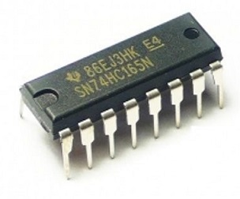

# am_joyin


**Amos Arcade Joystick Input Driver for Raspberry-pi (or another SBC)**

---

<p align="center">
  <p align="center">
    <a href="README.md">English</a>
    ·
    <a href="README_kr.md">한국어</a>
  </p>
</p>

---

am_joyin was designed and produced so that various input devices can be used when making an arcade game machine using Raspberry Pi.

Basically, it receives joystick input through GPIO or supports IO expansion boards such as 74HC165, MCP23017, and MUX.

Since various types of input devices can be used in the process of manufacturing a game machine, and combinations of these devices can also be varied, it was designed with emphasis on expandability and flexibility above all else.

In the process of developing this driver, mk_arcade_joystick_rpi was referred to.
Part of the main logic was borrowed, and for the convenience of users who used mk_arcade_joystick_rpi, intentionally tried to maintain the compatibility of the GPIO pinmap.
This is also for the purpose of applying am_joyin to existing devices more easily.

> ***NOTE:***\
> mk_arcade_joystick_rpi Project : `https://github.com/recalbox/mk_arcade_joystick_rpi`


**Keyword Description**

| Keyword    |   Description                                                  | Max                 |
|-----------|-----------------------------------------------------------------|---------------------|
| buttonset | Set of input information recognized by Raspberry Pi.            | 3 basic + 4 max     |
| endpoint  | The unit to be accessed from the Raspberry Pi. It is created in the form of /dev/input/js#. | 8 max               |
| device    | The device that will actually handle the input/output.          | 8 max               |


**Built-in button set (buttonset id = "default", index = 0)**

For the code used for the button, refer to the [input-event-codes.h](extra/input-event-codes.h) file.

| Key Code    | Code  | Min    | Max   |
|-------------|-------|--------|-------|
| ABS_Y       | 0x01  | -100   | 100   |
| ABS_X       | 0x00  | -100   | 100   |
| BTN_START   | 0x13B | 0      | 1     |
| BTN_SELECT  | 0x13A | 0      | 1     |
| BTN_A       | 0x130 | 0      | 1     |
| BTN_B       | 0x131 | 0      | 1     |
| BTN_X       | 0x133 | 0      | 1     |
| BTN_Y       | 0x134 | 0      | 1     |
| BTN_TL      | 0x136 | 0      | 1     |
| BTN_TR      | 0x137 | 0      | 1     |
| BTN_MODE    | 0x13C | 0      | 1     |
| BTN_TL2     | 0x138 | 0      | 1     |
| BTN_TR2     | 0x139 | 0      | 1     |
| BTN_TRIGGER | 0x120 | 0      | 1     |

**Basic ABS button set (buttonset id = "default_abs", index = 1)**

| Key Code     | Code  | Min    | Max   |
|--------------|-------|--------|-------|
| ABS_X        | 0x00  | -100   | 100   |
| ABS_Y        | 0x01  | -100   | 100   |
| ABS_RX       | 0x03  | -100   | 100   |
| ABS_RY       | 0x04  | -100   | 100   |
| ABS_THROTTLE | 0x06  | -100   | 100   |
| ABS_WHEEL    | 0x08  | -100   | 100   |
| ABS_HAT0X    | 0x10  | -100   | 100   |
| ABS_HAT0Y    | 0x11  | -100   | 100   |

**Built-in Mouse Buttonset (buttonset id = "default_mouse", index = 2)**

| Key Code     | Code  | Min    | Max   |
|--------------|-------|--------|-------|
| REL_X        | 0x00  | 0      | 0     |
| REL_Y        | 0x01  | 0      | 0     |
| BTN_LEFT     | 0x110 | 0      | 1     |
| BTN_RIGHT    | 0x111 | 0      | 1     |
| BTN_MIDDLE   | 0x112 | 0      | 1     |

---

## Install driver

### 0. Pre-work and development environment building

First, you need to do two things as a pre-work.

> 1. connect wifi and enable ssh
> 2. Connect to the Raspberry Pi via ssh.
> 3. Remove the mk_arcade_joystick_rpi driver if installed:
> * Enter retropie-setup in the retropie setup menu and remove mk_arcade_joystick_rpi from the driver item.
> * Execute $ sudo ~/RetroPie-Setup/retropie_setup.sh in the shell, and remove mk_arcade_joystick_rpi from the driver list.

Next, build an environment for driver building.

**1. Package update**

```sh
$ sudo apt update
```

**2. Install development tools**

```console
$ sudo apt install -y --force-yes dkms cpp-4.7 gcc-4.7 git joystick
```

**3. Install kernel headers**

```powershell
$ sudo apt install -y --force-yes raspberrypi-kernel-headers
```

**4. Enable I2C driver**

If you are using an I2C device such as mcp23017, ads1x15, or am_spinin, you must enable the I2C driver in advance.

First, include the following two lines in the module definition file, modules.conf.

```
i2c-bcm2708
i2c-dev
```

Alternatively, you can use the raspi-config configuration utility.

```sh
$ sudo raspi-config
```


<!--  -->


### 1. Install am_joyin driver

Once the preliminary work has been completed, the installation work begins in earnest.

#### When using wget

```sh
$ wget https://github.com/amos42/am_joyin/releases/download/v0.3.3/am_joyin-0.3.3.deb
$ sudo dpkg -i am_joyin-0.3.3.deb
```

#### When using git

1. Get the driver source.

```sh
$ git clone https://github.com/amos42/am_joyin.git
```

2. After creating the deb package, install it.

```sh
$ cd am_joyin
$ ./utils/makepackage.sh 0.3.3
$ sudo dpkg -i build/am_joyin-0.3.3.deb
```

If you go through this process, the driver installation is primarily completed.

If you want to check whether the installation was successful, you can use the modprobe command.

```sh
$ sudo modprobe am_joyin
```

If no error message occurs, the installation has been completed normally.


### 3-1. Automatic loading at driver boot (if not using I2C)

The following is the process to automatically load the am_joyin driver whenever the power is turned on.
To do this, add the am_joyin module to the module definition file.

> ***NOTE:***\
> Module definition file location: `/etc/modules-load.d/modules.conf`

Open the driver module configuration file.

```sh
$ sudo nano /etc/modules-load.d/modules.conf
```

Add the following to the last line:

```
  .
  .
  .

am_joyin
```

When editing is complete, press ctrl-x to save the file and exit.


### 3-2. Auto loading when driver boot (if using I2C)

If you are using an I2C device such as mcp23017, ads1x15, or am_spinin, you need to use a slightly different method.

This is because the initialization order of the module needs to be adjusted so that the am_joyin module is loaded after the I2C related service is started.
To do this, the command to load the module must be written in the rc.local script, not in the module definition file, modules.conf.

> ***NOTE:***\
> Even if I2C is not used, it may be described in rc.local instead of modules.conf. The difference between the two methods is as follows.
> * **modules.conf** : Loads modules before other services.
> * **rc.local** : Start loading the module after all other services are loaded.

First, check that the I2C driver is activated in advance.
Then, include the am_joyin module in rc.local using the modprobe command.

```sh
$ sudo nano /etc/rc.local
```

Insert the following content before the exit command on the last line.

```
  .
  .
  .

/sbin/modprobe am_joyin

  .
  .
  .
exit 0
```

When editing is complete, press ctrl-x to save the file and exit.

> ***NOTE:***\
> In some cases, the modules are blocked, so it is good to check the blacklist as well.
> If the module you want to use is included in the blacklist, you must find it and remove it.\
> Blacklist file location: `/etc/modprobe.d/raspi-blacklist.conf`


### 4. Set am_joyin

Next, proceed with driver settings.

> ***NOTE:***\
> am_joyin configuration file location: `/etc/modprobe.d/am_joyin.conf`

Open the configuration file with a text editor.

```sh
$ sudo nano /etc/modprobe.d/am_joyin.conf
```

If you want to apply 1P input device using GPIO, enter the following and press ctrl-x to save and exit.

```
options am_joyin device1="gpio;;0,default1"
```

> ***NOTE:***\
> If you omit this process and omit the am_joyin setting, am_joyin operates as the default default parameter.\
> This reproduces the same behavior as `mk_arcade_joystick_rpio map=1`.


### 5. Reboot the system

After the installation is complete, reboot the system and check the operation of the button.

```sh
$ sudo reboot
```


### 6. Driver operation test

To test the operation, you can use the jstest utility.

The installation method of the jstest utility is as follows.

```sh
$ sudo apt install joystick
```

If you want to test the first installed joystick device, enter as follows.

```sh
$ jstest /dev/input/js0
```

If executed normally, the current button status is displayed on the console. Each time you press or release the button, you can see that the state changes in real time.


### 7. Uninstall the driver

If you do not want to use am_joyin anymore and want to uninstall the driver, proceed in the reverse order of installation.

> 1. Delete the /etc/modprobe.d/am_joyin.conf file
> 2. Remove am_joyin from /etc/modules-load.d/modules.conf or /etc/rc.local list
> 3. Delete the driver package with the command $ sudo dpkg -r am-joyin-dkms

---

## Basics of setup parameters

### default format

am_joyin can use various combinations of devices through configuration.

By default, the whole consists of a one-line setting, and spaces are not allowed. If the line is too long to be viewed, you can write more than two lines using the \\ (backslash) character.

A setting consists of one or more parameters, and each parameter is described as a character string surrounded by " (quotation mark) because it contains special characters.

Each parameter consists of one or more sections, and the sections are separated by a ; (semicolon).

That is, the basic form is described in the following form.

```sh
parameter1="section1;section2;..." parameter2="section1;section2;..."
```

A section consists of one or more values, and each value is separated by a , (comma) character. Empty values ​​are also allowed.

The value can be one of the following:

| value | Description | form |
|----------|-----------|----------|
| (no value) | null | (no value) |
| numbers | numeric value | 0 |
| string | string value | hello |
| block | set of values ​​| {1,hello,world} |

The following is an example that actually describes this.

```sh
param1="text1;default,10;test,1,{1,a},{2,b}" param2="text1;;test,,{2,b,0},{3,,0}"
```

The interpretation of this is as follows.

```json
{
  "param1": {
    "section1": [ "text1" ],
    "section2": [ "default", 10 ],
    "section3": [ "test", 1, [1, "a"], [2, "b"]]
  },
  "param2": {
    "section1": [ "text1" ],
    "section2": null,
    "section3": ["test", null, [2, "b", 0], [3, null, 0]]
  }
}
```

### am_joyin parameters

The parameters of am_joyin are as follows.

| parameters | Description |
|-------------------------|--------------------|
| drivercfg | Driver Global Settings |
| buttonset1 ~ buttonset4 | buttonset settings |
| endpoints | endpoint list setup |
| device1 ~ device8 | device settings |


### driver global setting

> 1. report_period : key check period. Description in Hz. The default is 100Hz. (The maximum value is 1000Hz, but it is not recommended in practice.)
> 2. debug : Whether to debug mode. Affects log output contents.

### buttonset settings

* Button set parameter list
> 1. key_code - keycode
> 2. min_value - the minimum value of the button
> 3. max_value - the maximum value of the button

Basically, two buttonsets are built-in: "default" and "default_abs".

practical use case

```sh
buttonset1_cfg="{0x01,-100,100},{0x00,-100,100},{0x13B,0,1},{0x13A,0,1},{0x130,0,1},{0x103,0,1},{ 0x102,0,1},{0x103,0,1},{0x102,0,1},{0x103,0,1}"
```

Examples of inheriting and using previously declared ones

```sh
buttonset1_cfg="default,0,6;{0x01,0,32767},{0x103,0,1},{0x102,0,1},{0x103,0,1}"
```

In this case, 6 buttons in front of the "default" buttonset and additional user-defined buttons are used. At this time, if there is a duplicate key code, it is overriding. In this case, 0x01 is ABS_Y, which already exists in default, so it is replaced with the one declared later.

In addition to the default provided by default, the previously declared buttonset is also available, and it is also possible to include a plurality of them.

```sh
buttonset2_cfg="default,0,6;buttonset1,0,2;{0x102,0,1},{0x103,0,1}"
```

In this case, 6 buttons in front of the "default" buttonset and additional user-defined buttons are used. At this time, if there is a duplicate key code, it is overriding. In this case, 0x01 is ABS_Y, which already exists in default, so it is replaced with the one declared later.

### endpoint configuration

* List of endpoint parameters
> 1. endpoint_name - the name of the endpoint. With this name, the device is registered in the OS.
> 2. endpoint_type - The endpoint type. Joystick and Mouse can be specified.
> 3. buttonset - The name of the buttonset to use or the index of the buttonset. default is 0
> 4. button_count - the number of buttons to use. Default is all buttons in the button set.

practical use case

```sh
endpoints="default,,default,default;joystick,ext_joystick,1,11;mouse,,,4"
```

This setting has the following meanings.


> * first endpoint
> + endpoint type: default (default joystick)
> + name: empty value is interpreted as default (finally named "AmosJoystick_1")
> + button set index to use: default (default 0, which is the default joystick type)
> + number of buttons to use: default (the number specified in the button set)
> * second endpoint
> + endpoint type: joystick
> + Name: "ext_joystick"
> + use buttonset index: 1
> + number of buttons used: 11
> * third endpoint
> + endpoint type: mouse
> + name: empty value is interpreted as default (finally named "AmosMouse_1")
> + button set index to use: An empty value is interpreted as default (basically, 2, which is the default for mouse type)
> + number of buttons used: 4

### device configuration

Each device has individual settings.

default format

1. Type name
2. Device Settings
3. Set up n endpoints
    - Endpoint setting: Endpoint index, device setting for each endpoint

For example, suppose you have specified:

```sh
device1="74hc165;16,20,21,24;0,default,12;1,default,12"
```

This parameter is interpreted as follows.


> * Device type: "74hc165"
> * Device parameters: [ 16, 20, 21, 24, 1 ]
> * First endpoint:
> + endpoint index: 0
> + endpoint parameter: [ default, 12 ]
> * Second endpoint:
> + endpoint index: 1
> + endpoint parameter: [ default, 12 ]

The meaning of each parameter is interpreted differently for each device.

## Settings for each device

The currently supported device types are as follows.

| type name | Device Description |
|-----------|----------------------------------|
| gpio | Input via GPIO Direct |
| 74hc165 | 74HC165 shift register |
| mcp23017 | MCP23017 16-Bit I2C Input |
| mcp23s17 | MCP23S17 16-bit SPI input |
| mux | Multiplexer input |
| mcp3004 | MCP3004 4ch 10-bit SPI ADC |
| mcp3008 | MCP3008 8ch 10-bit SPI ADC |
| ads1015 | ADS1015 4ch 12-bit I2C ADC |
| ads1115 | ADS1115 4ch 16-bit I2C ADC |
| am_spinin | am_spinin Rotary Encoder Controller |

---

### GPIO input

It is the most basic GPIO, and it is a device that directly receives button input.

The default pinmap is compatible with mk_arcade_joystick_rpi.


* Device parameters
> None

* Endpoint parameters
> 1. config type - button setting type
>     - default (default1/default2/default3) : pin_count, button_start_index
>     - custom : code_mode (0: keycode, 1:index), {gpio1, button1, value1}, {gpio2, button2, value2}, ...

The order of buttons is basically in the order of 13 inputs: ***up, down, left, right, start, select, a, b, x, y, l1, r1, hotkey***.

- Set the primary key for 1P

```sh
$ sudo modprobe am_joyin device1="gpio;;0,default1,0,default"
```

- Set for 2P

```sh
$ sudo modprobe am_joyin endpoints="default,12;default,12" \
      device1="gpio;;0,default1,12;1,default2,12"
```

- Custom key settings

```sh
$ sudo modprobe am_joyin device1="gpio;;0,custom,0,{4,0x1,-100},{17,0x1,100},{27,0x0,-100},{22,0x0,100},{ 10,0x13b,1},{9,0x13a,1}"
```

- Set key combinations

It is also possible to combine key settings.
12 of the default1 gpio settings are used, and the HotKey custom is described as follows when specifying GPIO11.

```sh
$ sudo modprobe am_joyin device1="gpio;;0,default1,12;0,custom,,{11,0x13C,1}"
```

---

### 74HC165 input

TI's 74HC165 is a chip commonly used to expand insufficient IO. It is a chip that implements shift register and operates as a serial interface.
The biggest advantage of the 74HC165 is that the control method is very simple and it is easy to expand.
In addition, it can be said that it is one of the important advantages that it is widely used for a long time and has high reliability.




Since the 74HC165 is an 8-bit register, it is often necessary to use more than one in practice.
It seems that it is difficult to specify the number, so products that have been modularized are not sold very often.
Therefore, if necessary, you have to make your own input board using a universal board and use it.


This is how it was implemented with a PCB.


The circuit diagram and gerber file of the board can be obtained through the following link.

> - DIP version: https://github.com/amos42/pcbs/tree/master/joystick-input_2p
> - SMD version: https://github.com/amos42/pcbs/tree/master/joystick-input_smd
> - JST connector version: https://github.com/amos42/pcbs/tree/master/joystick-input_jst

To use the 74HC165 device, basically connect the VCC, GND and Load, Clock, Data (=Q8) pins to the power and GPIO pins of the Raspberry Pi.


The GPIO address corresponding to these 3 pins must be passed as a parameter.
They are LD, CK, DT in that order.

* Device parameters
> 1. LD - Load pin gpio number
> 2. CK - Clock pin gpio number
> 3. DT - Data(Q8) pin gpio number
> 4. IO Count - Total IO count
> 5. Bit Order - IO data order. 0 is the order of D7\~D0, 1 is the order of D0\~D7

* Endpoint parameters
> 1. config type - button setting type
>     - default : pin_count, button_start_index, io_skip_count
>     - custom : io_skip_count, code_mode (0: keycode, 1:index), {button1, value1}, {button2, value2}, ...

The order of buttons is basically in the order of 13 inputs: ***up, down, left, right, start, select, a, b, x, y, l1, r1, hotkey***.

practical use case

Example of using 1P (using 2 74HC165)

```sh
$ sudo modprobe am_joyin device1="74hc165;16,20,21;0,default,13"
```

Example of using 2p (when 3 74HC165s are used)

```sh
$ sudo modprobe am_joyin endpoints="default;default" device1="74hc165;16,20,21,24;0,default,12;1,default,12"
```

Example of using 2p (when 4 74HC165s are used)

```sh
$ sudo modprobe am_joyin endpoints="default;default" device1="74hc165;16,20,21,32;0,default;1,default"
```

---

### MCP23017 input

If you want to receive key input using I2C, you can use the MCP23017 chip. Since it is an I2C interface, it does not require a lot of wiring, and there is also expandability because multiple units can be bundled on the same wiring.
Because 16-bit IO is possible, it can accommodate enough input for 1P.


The MCP23017 module is mainly sold in the following forms.


Since it is an I2C device, it needs to know the address to access it. In the case of sold products, it is set to 0x20 by default, and the address can be changed through jumpers and soldering. In order to manufacture a 2p or higher joystick, two chips must be used, so they must be set to have different addresses.

* Device parameters
> 1. i2c_addr - I2C address. default is 0x20
> 2. io_count - total number of IOs

* Endpoint parameters
> 1. config type - button setting type
>     - default : pin_count, button_start_index, io_skip_count
>     - custom : io_skip_count, code_mode (0: keycode, 1:index), {button1, value1}, {button2, value2}, ...

practical use case

Example of 1P setup

```sh
$ sudo modprobe am_joyin device1="mcp23017;0x20,13;0,default"
```

Example of 2p setting (When the first board is set to 0x20, the second board is set to I2C address of 0x21)

```sh
$ sudo modprobe am_joyin endpoints="default;default" \
        device1="mcp23017;0x20;0,default" \
        device2="mcp23017;0x21;1,default"
```

---

### MCP23S17 input

MCP23S17 is similar to MCP23017. However, the difference is that the interface uses SPI rather than I2C.

Since it communicates with the SPI interface, in general, only two can be connected in Raspberry Pi, and they are separated by SPI channel numbers 0 and 1, respectively.

* Device parameters
> 1. spi_channel - SPI channel. default is 0
> 2. io_count - total number of IOs

* Endpoint parameters
> 1. config type - button setting type
>     - default : pin_count, button_start_index, io_skip_count
>     - custom : io_skip_count, code_mode (0: keycode, 1:index), {button1, value1}, {button2, value2}, ...

practical use case

Example of 1P setup

```sh
$ sudo modprobe am_joyin device1="mcp23s17;0,13;0,default"
```

Example of 2p setting (When the first board is set to SPI 0, the second board is set to SPI 1)

```sh
$ sudo modprobe am_joyin endpoints="default;default" \
        device1="mcp23s17;0;0,default" \
        device2="mcp23s17;1;1,default"
```

---

### Multiplexer(=MUX) input

There are various types of MUX chips depending on the number of input/output pins, and since they are manufactured by various companies, the range of choices is very wide. Since it is simply an implementation of MUX, the usage is almost the same. That is, 1 input/output pin, n address pins, and 2^n input/output pins are the core interfaces.

Among them, TI's 74HC4067, which implements 16-bit MUX, is the easiest to obtain and supports a sufficient number of pins for making 1P game consoles.

MUX modules are mainly sold in the following forms.


To use a 16-bit MUX device, basically connect 4 VCC, GND and Address pins and 1 IO pin to the power and GPIO pins of the Raspberry Pi, respectively.


The GPIO numbers corresponding to these 5 pins must be passed as parameters respectively.

* Device parameters
> 1. rw_gpio - read/write pin gpio number
> 2. {addr0_gpio, addr1_gpio, ...} - gpio address list of address pins
> 3. cs_gpio - Chip enable gpio number (default is -1)
> 4. active_high - Is the chip enable value high active (default is low active)
> 5. io_count - total number of IOs

* Endpoint parameters
> 1. config type - button setting type
>     - default : pin_count, button_start_index, io_skip_count
>     - custom : io_skip_count, code_mode (0: keycode, 1:index), {button1, value1}, {button2, value2}, ...

If you want to support more than 2p, use two 16-bit MUXs to make it 32-bit, and one of the following three methods to access each chip in turn.

> * Share the address pin and data pin, and set each device's cs_gpio differently.
> * Share the address pin and set the data pin differently.
> * Use 1-bit MUX additionally to control the enable pin of each chip using the most significant bit of the address.

practical use case

Example of 1P setup

```sh
$ sudo modprobe am_joyin device1="mux;5,{26,19,13,6},,13;0,default"
```

Example of 2p setting (when address pin and data pin are shared, and Enable pin of each MUX is connected to GPIO 20 and GPIO 21, respectively)

```sh
$ sudo modprobe am_joyin endpoints="default;default" \
        device1="mux;5,{26,19,13,6},20;0,default" \
        device2="mux;5,{26,19,13,6},21;1,default"
```

Example of 2p setup (if you share address pin and write data pin differently)

```sh
$ sudo modprobe am_joyin endpoints="default;default" \
        device1="mux;5,{26,19,13,6};0,default" \
        device2="mux;16,{26,19,13,6};1,default"
```

---

### MCP3008/MCP3004 ADC input

For analog joystick input, ADC chip is required. Usually, one analog stick has two axes, so ADC must also have at least two channels.

A relatively common ADC chip is MCP3008/MCP3004, which supports SPI interface and has 10-bit resolution. The only difference between MCP3008 and MCP3004 is that they can receive 8 channel and 4 channel analog input, respectively, and the rest of the specifications are the same.
If delicate input is not required, the sensitivity level of the joystick is sufficient even with 10-bit resolution, and if one 2-axis stick is used per 1P to support 8 channels, up to 4p can be supported with one MCP3008 chip.

The MCP3008 is rarely sold in the form of a module, so the chip package is used as it is. Therefore, you can purchase a DIP type chip and connect it directly. When using this way, you need to pay attention to countermeasures against power noise.


Pinout of MCP3008 is as follows.


In order to wire the analog stick to the Raspberry Pi through the actual MCP3008, refer to the following wiring diagram.


 VDD and VREF can be connected to 3.3v of Raspberry Pi.
 The CS pin can be connected to either SPI_CE0 or SPI_CE1 of the Raspberry Pi according to the SPI channel to be used.

* Device parameters
> 1. spi_channel - SPI channel. Default 0
> 2. value_weight_percent - LPF weight. Unit %, default 100
> 3. sampling_count - The number of LPF samplings. Default 10

* Endpoint parameters
> 1. config type - button setting type
>     - default : pin_count, button_start_index
>     - custom : code_mode (0: keycode, 1:index), {adc channel1, button1, min_value1, max_value1, adc_min_value1, adc_max_value1, adc_mid_value1}, ...

practical use case

In the case of ADC, rather than being used alone, it is usually set by adding an analog stick to another button input device.

The following is a setting that adds an analog stick to the MCP3008 in addition to the existing 74HC165 input.

Example of 1P setting (change the default arrow keys to analog)

```sh
$ sudo modprobe am_joyin device1="74hc165;16,20,21,16;0,default,13,4" \
        device2="mcp3008;;0,custom,keycode,{0,0x03,-100,100},{1,0x04,-100,100}"
```

Example of 1P setup (add analog axes Rx,Ry)

```sh
$ sudo modprobe am_joyin buttonset1="default,0,12;{0x03,-100,100},{0x04,-100,100}" \
        endpoints="default,buttonset1" \
        device1="74hc165;16,20,21,16;0,default" \
        device2="mcp3008;;0,custom,keycode,{0,0x03,-100,100},{1,0x04,-100,100}"
```

Example of 2p setup (add analog axes Rx,Ry)

```sh
$ sudo modprobe am_joyin buttonset1="default,0,11;{0x03,-100,100},{0x04,-100,100}" \
        endpoints="default,buttonset1;default,buttonset1" \
        device1="74hc165;16,20,21,32;0,default;1,default" \
        device2="mcp3008;;0,custom,,{0,0x03,-100,100},{1,0x04,-100,100};1,custom,,{2,0x03,-100,100},{3,0x04,-100,100 }"
```

If you test with jstest, you can see that two new axes have been added, and the input value changes sequentially according to the inclination of the joystick.


---

### ADS1115/ADS1015 ADC input

ADS1115/ADS1015 are one of the chips that are often used as ADCs. It supports I2C interface and is a 4 channel ADC. The difference between the two chips is the difference in resolution and sampling rate. Either way, the performance is sufficient to be used as an analog joystick input for a game machine.

ADS1115 has 16-bit resolution and ADS1015 has 12-bit resolution, but since it includes a negative voltage, when used in a joystick, 15-bit and 11-bit resolutions can be used, respectively. Other than that, the pintout and control methods are almost the same, and the input ADC channels are also the same as both.


Pinout of ADS1115 module is as follows.


ADS1115/ADS1015 supports 4 channel inputs, so basically two joysticks with 2 axes can be connected. If you want to connect more joysticks, you need to connect additional ADC boards. In this case, the I2C addresses of the two boards must be set differently.

I2C address setting of ADS1115/ADS1015 is determined by where ADDR pin is connected as follows.


ADS1115/ADS1015 does not have a separate pin for receiving the reference voltage. Therefore, it is good to use it for the purpose of measuring the correct voltage, but it is rather cumbersome to find the voltage division ratio according to the inclination within the specified voltage range like an analog joystick. The correct voltage of VCC connected to the joystick should be measured in advance, and the value should be reflected in the setting in advance. Or, it can be replaced by correction work such as calibration in S/W after the fact.

* Device parameters
> 1. i2c_addr - i2c address value. Default 0x48
> 2. ref_milli_volt - the reference voltage of the ADC. unit mv. Default 3300 (3.3v)
> 2. adc_gain - the amplification factor of the analog input value. Values ​​range from 0 to 5. 4.096v as the reference voltage means 2/3, 1, 2, 4, 8, 16 in sequence. default 1
> 3. value_weight_percent - LPF weight. Unit %, default 100
> 4. sampling_count - The number of LPF samplings. Default 10

* Endpoint parameters
> 1. config type - button setting type
>     - default : pin_count, button_start_index
>     - custom : code_mode (0: keycode, 1:index), {adc channel1, button1, min_value1, max_value1, adc_min_value1, adc_max_value1, adc_mid_value1}, ...

practical use case

In the case of ADC, rather than being used alone, it is usually set by adding an analog stick to another button input device.

The following is a setting that adds an analog stick to the ADS1115 in addition to the existing 74HC165 input.

Example of 1P setting (change the default arrow keys to analog)

```sh
$ sudo modprobe am_joyin device1="74hc165;16,20,21,16;0,default,13,4" \
        device2="ads1115;;0,custom,keycode,{0,0x03,-100,100},{1,0x04,-100,100}"
```

Example of 1P setup (add analog axes Rx,Ry)

```sh
$ sudo modprobe am_joyin buttonset1="default,0,12;{0x03,-100,100},{0x04,-100,100}" \
        endpoints="default,buttonset1" \
        device1="74hc165;16,20,21,16;0,default" \
        device2="ads1115;;0,custom,keycode,{0,0x03,-100,100},{1,0x04,-100,100}"
```

Example of 2p setup (add analog axes Rx,Ry)

```sh
$ sudo modprobe am_joyin buttonset1="default,0,11;{0x03,-100,100},{0x04,-100,100}" \
        endpoints="default,buttonset1;default,buttonset1" \
        device1="74hc165;16,20,21,32;0,default;1,default" \
        device2="ads1115;;0,custom,,{0,0x03,-100,100},{1,0x04,-100,100};1,custom,,{2,0x03,-100,100},{3,0x04,-100,100 }"
```

If you test with jstest, you can see that two new axes have been added, and the input value changes sequentially according to the inclination of the joystick.


---

### am_spinin Rotary Encoder input

Games like Arkanoid use spinners as injection force devices.
To implement this spinner, you can use a device such as a Rotary Encoder. In this case, the rotary encoder to be used is not a single-phase type for RPM measurement, but a two-phase type or higher for bi-directional rotation, and the resolution must be at least 100 P/R. In fact, you don't need any higher resolution than that for classic arcade games.

Rotary Encoders are mainly sold in the following forms.


In the case of two-phase type, there are a total of 4 output pins, and there are A and B pins in addition to the power pins of VCC and GND. The power is usually 5V~24V, and it does not operate normally if it is less than 5V. Because high current is not required, you just need to get 5V power from the Raspberry Pi.

The Raspberry Pi is not a suitable device for real-time systems. Therefore, even pulses of about tens of kHz are not suitable for real-time counting. Therefore, a Rotary Encoder controller is required to actually use it.
It is best to use a counter chip like the LS7366R for the controller, but it is difficult to find one that is sold as a separate module, and if you purchase a separate encoder counter board, it is inappropriate for use in a game machine because it is a burdensome price for industrial use.
Because it receives human hand movements anyway, a high-speed, high-precision controller is not required, so you can make a controller for a spinner with the performance of an Arduino.

Actually, the board to be used as the controller is the Arduino Pro Mini. There are 3.3V and 5V versions respectively, either can be used.


The Rotary Encoder controller firmware for this board can be downloaded from the following link.

> - https://github.com/amos42/am_spinin

When the firmware upload is completed, start wiring to the corresponding control board.
The Rotary Encoder's A and B pins are respectively connected to GPIO pins 2 and 3 of the board.

A4 and A5 pins of the control board are I2C pins, and they are SDA and SCL pins, respectively. Connect these to GPIO2 (SDA1) and GPIO3 (SCL1) of the Raspberry Pi, respectively.


When setting the driver, carefully set the P/R of the Rotary Encoder and the DPI of the mouse.

* Device parameters
> 1. comm_type - communication method. Choice of i2c/spi. default i2c
> 1. addr - i2c address or spi channel. Default is 0x34 for i2c, 0 for spi
> 2. rotary_ppr - P/R of Rotary Encoder (number of pulses per rotation). Default 360
> 3. min_value - the minimum value
> 4. max_value - the maximum value
> 5. sample_rate - Sampling period when using absolute coordinates. Default 10ms

* Endpoint parameters
> 1. config type - button setting type
>     - default : pin_count, button_start_index, mouse_dpi (default 1000dpi)
>     - custom : mouse_dpi, code_mode (0: keycode, 1:index), {button1, value1}, ...

practical use case

Rotary encoders are mainly used for the purpose of supporting spinners in arcade game machines. Therefore, rather than being used alone, it is generally common to set by adding a spinner to other button input devices.

The following is a setting that adds a spinner as am_spinin to the existing 74HC165 input.

Example of 1P setup (make mouse x-axis the default)

```sh
$ sudo modprobe am_joyin endpoints="joystick;mouse" \
        device1="74hc165;16,20,21;0,default,13" \
        device2="am_spinin;i2c,0x34,400;1,,1"
```

Example of 2p setup

```sh
$ sudo modprobe am_joyin endpoints="joystick;joystick;mouse;mouse" \
        device1="74hc165;24,20,21;0,default,12;1,default,12" \
        device2="am_spinin;i2c,0x34,400;2,,1" \
        device3="am_spinin;i2c,0x35,400;3,,1"
```

For games such as Arkanoid, add mouse support in RetroArch settings.


---

> ***NOTE:***
> The am_joyin driver has been tested on Raspberry Pi Zero, Raspberry Pi Zero W, Raspberry Pi 3B, Raspberry Pi 3B+, Raspberry Pi 4B.
> Operation for other models is not guaranteed.
