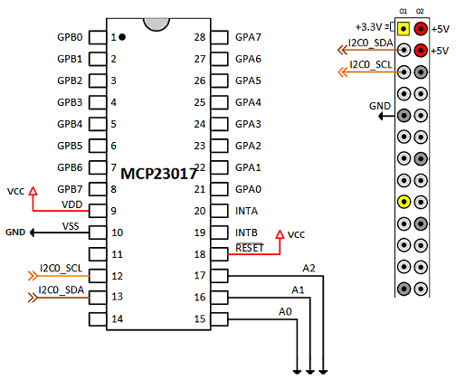

# am_joyin

---

Amos Joystick Input Driver for Raspbrri-pi Arcade (or another SBC)

am_joyin은 라즈베리파이를 이용하여 아케이드 게임기를 제작할 때 다양한 입력장치를 사용할 수 있도록 기획되고 제작되었다.

기본적으로 GPIO를 통해 조이스틱을 입력 받거나, 74HC165, MCP23017, MUX 등의 IO 확장 보드 등을 지원한다.

게임기를 제작하는 과정에서 다양한 형태의 입력 장치를 사용할 수 있고, 또한 이런 장치들의 조합 역시 다양할 수 있기에, 무엇보다 확장성과 유연성에 중점을 두고 설계되었다.

이 드라이버 개발 과정에서 mk_arcade_joystick_rpi를 참고했다.
주요한 로직의 일부를 차용했으며, 기존에 mk_arcade_joystick_rpi를 사용하던 사용자들의 편의를 위해 의도적으로 GPIO 핀맵의 호환성을 유지하려 노력했다.
이는 기존에 제작 된 기기에 좀 더 수월하게 am_joyin을 적용하기 위한 목적도 있다.

> ***NOTE:***\
> mk_arcade_joystick_rpi 프로젝트 사이트 : https://github.com/recalbox/mk_arcade_joystick_rpi


**키워드 설명**

| 키워드     |   설명                                                          | 최대 갯수           |
|-----------|-----------------------------------------------------------------|---------------------|
| buttonset | 라즈베리파이에서 인식하는 입력 정보의 집합                         | 기본 3개 + 최대 4개 |
| endpoint  | 라즈베리파이에서 액세스 할 단위. /dev/input/js#의 형태로 생성된다. | 최대 8개            |
| device    | 입출력을 실제로 처리할 장치                                       | 최대 8개            |


**기본 제공 버튼셋 (buttonset id = "default", index = 0)**

버튼에 사용하는 코드는 [input-event-codes.h](extra/input-event-codes.h) 파일을 참고하면 된다.

| 키코드       | 코드  | 최소값 | 최대값 |
|-------------|-------|--------|-------|
| ABS_Y       | 0x01  | -100   | 100   |
| ABS_X       | 0x00  | -100   | 100   |
| BTN_START   | 0x13B | 0      | 1     |
| BTN_SELECT  | 0x13A | 0      | 1     |
| BTN_A       | 0x130 | 0      | 1     |
| BTN_B       | 0x131 | 0      | 1     |
| BTN_X       | 0x133 | 0      | 1     |
| BTN_Y       | 0x134 | 0      | 1     |
| BTN_TL      | 0x136 | 0      | 1     |
| BTN_TR      | 0x137 | 0      | 1     |
| BTN_MODE    | 0x13C | 0      | 1     |
| BTN_TL2     | 0x138 | 0      | 1     |
| BTN_TR2     | 0x139 | 0      | 1     |
| BTN_TRIGGER | 0x120 | 0      | 1     |

**기본 제공 ABS 버튼셋 (buttonset id = "default_abs", index = 1)**

| 키코드        | 코드  | 최소값 | 최대값 |
|--------------|-------|--------|-------|
| ABS_X        | 0x00  | -100   | 100   |
| ABS_Y        | 0x01  | -100   | 100   |
| ABS_RX       | 0x03  | -100   | 100   |
| ABS_RY       | 0x04  | -100   | 100   |
| ABS_THROTTLE | 0x06  | -100   | 100   |
| ABS_WHEEL    | 0x08  | -100   | 100   |
| ABS_HAT0X    | 0x10  | -100   | 100   |
| ABS_HAT0Y    | 0x11  | -100   | 100   |

**기본 제공 Mouse 버튼셋 (buttonset id = "default_mouse", index = 2)**

| 키코드        | 코드  | 최소값 | 최대값 |
|--------------|-------|--------|-------|
| REL_X        | 0x00  | 0      | 0     |
| REL_Y        | 0x01  | 0      | 0     |
| BTN_LEFT     | 0x110 | 0      | 1     |
| BTN_RIGHT    | 0x111 | 0      | 1     |
| BTN_MIDDLE   | 0x112 | 0      | 1     |


## 드라이버 설치

### 0. 사전 작업 및 개발 환경 구축

먼저 사전 작업으로 2가지를 해야 한다.

> 1. wifi 연결 및 ssh 활성화
> 2. 라즈베리파이에 ssh로 접속한다.
> 3. 만약 mk_arcade_joystick_rpi 드라이버가 설치되어 있다면 제거 :
>    * retropie 설정 메뉴에서 retropie-setup으로 들어가, 드라이버 항목에서 mk_arcade_joystick_rpi 를 제거한다.
>    * shell에서 sudo ~/RetroPie-Setup/retropie_setup.sh 를 실행하여, 드라이버 항목에서 mk_arcade_joystick_rpi 를 제거한다.

다음으로는 드라이버 빌드를 위한 환경을 구축한다.

**1. 패키지 업데이트**

```shell
sudo apt update
```

**2. 개발툴 설치**

```shell
sudo apt install -y --force-yes dkms cpp-4.7 gcc-4.7 git joystick
```

**3. 커널 헤더 설치**

```shell
sudo apt install -y --force-yes raspberrypi-kernel-headers
```


### 1. am_joyin 드라이버 설치

사전 작업이 마무리 되었다면 본격적으로 설치 작업을 진행한다.

#### wget 사용시

```shell
wget https://github.com/amos42/am_joyin/releases/download/v0.3.1-beta01/am_joyin-0.3.1.deb
sudo dpkg -i am_joyin-0.3.1.deb
```

#### git 사용시

1. 드라이버 소스를 받는다.

```shell
git clone https://github.com/amos42/am_joyin.git
```

2. deb 패키지를 생성 후 설치한다.

```shell
cd am_joyin
./utils/makepackage.sh 0.3.1 
sudo dpkg -i build/am_joyin-0.3.1.deb
```
​
이 과정까지 거치면 드라이버 설치가 1차적으로 완료된다.

설치가 정상적으로 되었는지를 확인하고 싶다면 modprobe 명령을 사용하면 된다.

```shell
sudo modprobe am_joyin
```

만약 에러 메시지가 발생하지 않는다면 정상적으로 설치가 완료 된 것이다.


### 3. 드라이버 부팅시 자동 로딩

다음은 전원을 켤 때마다 자동으로 am_joyin 드라이버가 로딩되도록 하기 위한 과정이다.

드라이버 모듈 설정 파일을 연다.

```shell
sudo nano /etc/modules-load.d/modules.conf
```

마지막 라인에 다음 항목을 추가하고 ctrl-x를 눌러 저장하고 종료한다.

```
  .
  .
  .

am_joyin
```


### 4. am_joyin 설정

다음으로는 드라이버 설정을 진행한다.

> ***NOTE:***\
> am_joyin 설정 파일 위치 : /etc/modprobe.d/am_joyin.conf

텍스트 에디터로 설정 파일을 연다.

```shell
sudo nano /etc/modprobe.d/am_joyin.conf
```

GPIO를 이용한 1P 입력 장치를 적용하고 싶다면 다음과 같이 입력하고 ctrl-x를 눌러 저장하고 종료한다.

```
options am_joyin device1="gpio;;0,default1"
```

> ***NOTE:***\
> 만약 이 과정을 생략하고 am_joyin 설정을 누락시키면 am_joyin은 기본 default 파라미터로 동작한다.\
> 이는 `mk_arcade_joystick_rpio map=1` 과 같은 동작을 재현한다.


### 5. 시스템 재부팅

설치 작업이 완료되었다면 시스템을 재부팅하여 버튼의 동작을 확인하면 된다.

```shell
sudo reboot
```

### 6. 드라이버 동작 테스트

동작 테스트를 위해서는 jstest 유틸리티를 사용하면 된다.

jstest 유틸리티의 설치 방법은 다음과 같다.

```shell
sudo apt install joystick
```

만약 첫번째 설치 된 조이스틱 장치를 테스트 해 보고 싶다면 다음과 같이 입력한다.

```shell
jstest /dev/input/js0
```

정상적으로 실행되면 콘솔 상에 현재 버튼 상태가 나타난다. 버튼을 누르거나 뗄 때마다 실시간으로 상태가 변경됨을 확인할 수 있다.


### 7. 드라이버 삭제

드라이버를 삭제하기 위해선 설치한 순서의 반대로 진행하면 된다.

> 1. /etc/modprobe.d/am_joyin.conf 파일 삭제
> 2. /etc/modules-load.d/modules.conf 목록에서 am_joyin 제거
> 3. sudo dpkg -r am-joyin-dkms 명령으로 드라이버 패키지 삭제


---

## 설정 파라미터의 기본

### 기본 형식

am_joyin은 설정을 통해 다양한 조합의 장치들을 이용할 수 있다.

기본적으로 전체가 1줄짜리 설정으로 이루어져 있으며, 공백은 허용되지 않는다. 줄이 너무 길어져 보기에 불편하다 생각되면 \\(backslash) 문자를 통해 2줄 이상으로 기술할 수도 있다.

설정은 1개 이상의 파라미터(parameter)들로 구성되어 있으며, 각 파라미터들은 특수문자를 포함하기 때문에 "(quotation mark)로 감싼 문자열로 기술한다.

각 파라미터는 1개 이상의 섹션(section)들로 구성되어 있으며, 섹션들은 ;(semicolon)으로 구분한다.

즉, 기본 형태는 다음과 같은 형태로 기술되게 된다.

```shell
parameter1="section1;section2;..." parameter2="section1;section2;..."
```

section은 1개 이상의 값으로 구성되어 있으며, 각 값들은 ,(comma) 문자로 구분된다. 빈 값도 허용된다.

값은 다음 중 하나가 될 수 있다.

| 값       |  설명      | 형태              |
|----------|-----------|-------------------|
| (값없음) | null      | (값없음)           |
| 숫자     | 숫자값     | 0                 |
| 문자열   | 문자열 값   | hello            |
| 블럭     | 값들의 집합 | {1,hello,world}  |

다음은 이를 실제로 기술한 예이다.

```shell
param1="text1;default,10;test,1,{1,a},{2,b}" param2="text1;;test,,{2,b,0},{3,,0}"
```

이를 해석하면 다음과 같다.

```json
{
  "param1": {
    "section1": [ "text1" ],
    "section2": [ "default", 10 ],
    "section3": [ "test", 1, [1, "a"], [2, "b"]]
  },
  "param2": {
    "section1": [ "text1" ],
    "section2": null,
    "section3": ["test", null, [2, "b", 0], [3, null, 0]]
  }
}
```

### am_joyin의 파라미터들

am_joyin의 파라미터는 다음과 같다.

| 파라미터                 |  설명              | 
|-------------------------|--------------------|
| drivercfg               | 드라이버 전역 설정  |
| buttonset1 ~ buttonset4 | buttonset 설정     |
| endpoints               | endpoint 목록 설정 |
| device1 ~ device8       | device 설정        |


### driver 전역 설정

> 1. timer_period : 타이머 주기. Hz 단위로 기술. default는 100Hz. (OS의 인터럽트 세팅에 따라 최대치가 결정된다.)
> 2. debug : 디버그 모드 여부. Log 출력 내용에 영향을 준다.

### buttonset 설정

* 버튼셋 파라미터 리스트
> 1. key_code - 키코드
> 2. min_value - 버튼 최소값
> 3. max_value - 버튼 최대값

기본적으로 "default"와 "default_abs"의 2개 buttonset이 내장되어 있다.

실제 사용 예

```shell
buttonset1_cfg="{0x01,-100,100},{0x00,-100,100},{0x13B,0,1},{0x13A,0,1},{0x130,0,1},{0x103,0,1},{0x102,0,1},{0x103,0,1},{0x102,0,1},{0x103,0,1}"
```

이전에 선언 된 것을 상속하여 사용한 예

```shell
buttonset1_cfg="default,0,6;{0x01,0,32767},{0x103,0,1},{0x102,0,1},{0x103,0,1}"
```

이 경우, "default" buttonset의 앞이 6개 버튼과, 추가로 사용자 정의 버튼을 사용하게 된다. 이때, 만약 중복 된 키코드가 존재한다면 overriding이 된다. 이 경우 0x01은 ABS_Y로, 이미 default에 존재하기에 뒤에 선언한 것으로 대체된다.

기본 제공 되는 default 외에도 앞서 선언 한 buttonset도 이용 가능하며, 복수개를 포함시키는 것도 가능하다.

```shell
buttonset2_cfg="default,0,6;buttonset1,0,2;{0x102,0,1},{0x103,0,1}"
```

이 경우, "default" buttonset의 앞이 6개 버튼과, 추가로 사용자 정의 버튼을 사용하게 된다. 이때, 만약 중복 된 키코드가 존재한다면 overriding이 된다. 이 경우 0x01은 ABS_Y로, 이미 default에 존재하기에 뒤에 선언한 것으로 대체된다.

### endpoint 설정

* 엔드포인트 파라미터 리스트
> 1. endpoint_name - 엔드포인트 이름. 이 이름으로 OS에 장치 등록이 된다.
> 2. endpoint_type - 엔드포인트 타입. Joystick과 Mouse 등을 지정할 수 있다.
> 3. buttonset - 사용할 버튼셋 이름 혹은 버튼셋의 index. default는 0
> 4. button_count - 사용할 버튼 갯수. default는 버튼셋의 버튼 전체

실제 사용 예

```shell
endpoints="default,,default,default;joystick,ext_joystick,1,11;mouse,,,4"
```

이 설정은 다음과 같은 의미를 갖는다.


> * 첫번째 엔드포인트
>   + 엔드포이트 타입 : default (기본적으로 joystick)
>   + 이름 : 빈 값은 default로 해석 (최종적으로 "AmosJoystick_1" 이름이 부여)
>   + 사용 버튼셋 인덱스 : default (기본적으로 joystick 타입의 default인 0)
>   + 사용 버튼 갯수 : default (버튼셋에서 지정된 갯수)
> * 두번째 엔드포인트
>   + 엔드포이트 타입 : joystick
>   + 이름 : "ext_joystick"
>   + 사용 버튼셋 인덱스 : 1
>   + 사용 버튼 갯수 : 11
> * 세번째 엔드포인트
>   + 엔드포이트 타입 : mouse
>   + 이름 : 빈 값은 default로 해석 (최종적으로 "AmosMouse_1" 이름이 부여)
>   + 사용 버튼셋 인덱스 : 빈 값은 default로 해석 (기본적으로 mouse 타입의 default인 2)
>   + 사용 버튼 갯수 : 4

### device 설정

각 장치별로 개별 설정을 갖는다.

기본 포맷

1. 타입 이름
2. 디바이스 설정
3. n개의 엔드포인트 설정
    - 엔드포인트 설정 : 엔드포인트 인덱스, 엔드포인트별 장치 설정

예를 들어 다음과 같이 지정했다고 가정하자.

```shell
device1="74hc165;16,20,21,24,1;0,default,12;1,default,12"
```

이 파라미터는 다음과 같이 해석된다.


> * 장치 타입 : "74hc165"
> * 장치 파라미터 : [ 16, 20, 21, 24, 1 ]
> * 첫번째 엔드포인트 :
>   + 엔드포인트 인덱스 : 0
>   + 엔드포인트 파라미터 : [ default, 12 ]
> * 두번째 엔드포인트 :
>   + 엔드포인트 인덱스 : 1
>   + 엔드포인트 파라미터 : [ default, 12 ]

각각의 파라미터의 의미는 각 장치별로 해석을 달리한다.

## 각 장치별 설정

현재 지원 가능한 장치 타입은 다음과 같다.

| 타입명    | 장치 설명                         |
|-----------|----------------------------------|
| gpio      | GPIO 다이렉트로 입력              |
| 74hc165   | 74HC165 시프트 레지스터           |
| mcp23017  | MCP23017 16비트 I2C 입력          |
| mcp23s17  | MCP23S17 16비트 SPI 입력          |
| mux       | Multiplexer 입력                  |
| mcp3004   | MCP3004 4ch 10비트 SPI ADC        |
| mcp3008   | MCP3008 8ch 10비트 SPI ADC        |
| ads1015   | ADS1015 4ch 12비트 I2C ADC        |
| ads1115   | ADS1115 4ch 16비트 I2C ADC        |
| am_spinin | am_spinin Rotary Encoder 컨트롤러 |


### GPIO 입력

가장 기본이 되는 GPIO로 직접 버튼의 입력을 받는 장치이다.

기본 핀맵은 mk_arcade_joystick_rpi와 호환되도록 하고 있다.


* 디바이스 파라미터
> 없음

* 엔드포인트 파라미터
> 1. config type - 버튼 설정 타입
>    - default : pin_count, button_start_index
>    - custom : code_mode (0: keycode, 1:index), {gpio1, button1, value1}, {gpio2, button2, value2}, ...

- 1인용 기본 키 설정

```shell
sudo modprobe am_joyin device1="gpio;;0,default1,0,default"
```

- 2인용 설정

```shell
sudo modprobe am_joyin endpoints="default,12;default,12" \
      device1="gpio;;0,default1,12;1,default2,12"
```

- 커스텀 키 설정

```shell
sudo modprobe am_joyin device1="gpio;;0,custom,0,{4,0x1,-100},{17,0x1,100},{27,0x0,-100},{22,0x0,100},{10,0x13b,1},{9,0x13a,1}"
```

### 74HC165 입력

부족한 IO를 확장하기 위해 많이 쓰이는 칩이 TI사의 74HC165이다. shift register를 구현한 칩이며, 시리얼 인터페이스로 동작한다.
74HC165의 가장 큰 장점은, 제어 방법이 무척 단순하고 확장성이 용이하다는 점이다.
또한 오랜 기간 널리 사용되며 높은 신뢰도를 얻고 있다는 점도 중요한 장점 중 하나라고 할 수 있다.


74HC165는 8-bit 레지스터이기 때문에, 실제로 사용할 땐 복수개를 사용해야 하는 경우가 많다.
갯수를 특정하기 힘들어서인지, 이를 모듈화 해 놓은 상품은 그다지 흔히 판매되지 않은 듯 하다.
때문에 필요하다면 만능 기판 등을 이용해 직접 입력 보드를 만들어서 사용해야 한다.


이를 PCB로 구현한 모습이다.


해당 보드의 회로도는 다음의 링크를 통해 얻을 수 있다.

> - DIP 버전 : https://github.com/amos42/pcbs/tree/master/joystick-input
> - SMD 버전 : https://github.com/amos42/pcbs/tree/master/joystick-input_smd

74HC165 장치를 사용하기 위해서는 기본적으로 VCC, GND 및 Load, Clock, Data (=Q8) 핀을 라즈베리파이의 전원 및 GPIO 핀에 연결한다.


이 3개 핀에 해당하는 GPIO 주소를 파라미터로 전달해야 한다.
순서대로 LD, CK, DT 이다.

* 디바이스 파라미터
> 1. LD - Load 핀 gpio 번호
> 2. CK - Clock 핀 gpio 번호
> 3. DT - Data(Q8) 핀 gpio 번호
> 4. IO Count - 전체 IO 갯수
> 5. Bit Order - IO 데이터 순서. 0은 D7\~D0 순서, 1은 D0\~D7 순서

* 엔드포인트 파라미터
> 1. config type - 버튼 설정 타입
>    - default : pin_count, button_start_index, io_skip_count
>    - custom : io_skip_count, code_mode (0: keycode, 1:index), {button1, value1}, {button2, value2}, ...

실제 사용 예

1p 사용의 예 (74HC165 2개 사용)

```shell
sudo modprobe am_joyin device1="74hc165;16,20,21;0,default,13"
```

2p 사용의 예 (74HC165 3개를 썼을 경우)

```shell
sudo modprobe am_joyin endpoints="default;default" device1="74hc165;16,20,21,24;0,default,12;1,default,12"
```

2p 사용의 예 (74HC165 4개를 썼을 경우)

```shell
sudo modprobe am_joyin endpoints="default;default" device1="74hc165;16,20,21,32;0,default;1,default"
```

### MCP23017 입력

I2C를 이용해 키 입력을 받고자 한다면 MCP23017 칩을 사용하면 된다. I2C 인터페이스이기에 많은 배선을 필요로 하지 않고, 복수개를 같은 배선에 묶어서 사용할 수 있기 때문에 확장성도 있다.
16-bit IO가 가능하기 때문에 1p용 입력을 충분히 수용할 수 있다.



MCP23017 모듈은 다음과 같은 형태로 주로 판매되고 있다.


I2C 장치이기 때문에 액세스를 위해서는 주소를 알아야 한다. 판매되는 상품의 경우엔 기본적으로 0x20으로 세팅되어 있으며, 점퍼 및 납땜을 통해 주소를 변경할 수 있다. 2p 이상인 조이스틱 제작을 위해서는 2개의 칩을 사용해야 하기 때문에, 필히 서로 다른 주소를 갖도록 세팅되어 있어야 한다.

* 디바이스 파라미터
> 1. i2c_addr - I2C 주소. default는 0x20
> 2. io_count - 전체 IO 갯수

* 엔드포인트 파라미터
> 1. config type - 버튼 설정 타입
>    - default : pin_count, button_start_index, io_skip_count
>    - custom : io_skip_count, code_mode (0: keycode, 1:index), {button1, value1}, {button2, value2}, ...

실제 사용 예

1p 설정의 예

```shell
sudo modprobe am_joyin device1="mcp23017;0x20,13;0,default"
```

2p 설정의 예 (첫번째 보드는 0x20, 두번째 보드는 0x21의 I2C 주소로 설정해 놓았을 때)

```shell
sudo modprobe am_joyin endpoints="default;default" \
        device1="mcp23017;0x20;0,default" \
        device2="mcp23017;0x21;1,default"
```

### Multiplexer(=MUX) 입력

MUX 칩은 입출력 핀수에 따라 다양한 칩들이 존재하며, 다양한 회사에서 만들어 내고 있기 때문에 선택의 폭은 아주 넓다. 단순히 MUX를 구현한 것일 뿐이기 때문에 사용법도 모두 거의 대동소이하다. 즉, 입출력핀 1개와 주소핀 n개, 그리고 2^n 개의 입출력핀이 핵심 인터페이스이다.

이 중 16-bit MUX를 구현한 TI사의 74HC4067 가장 구하기도 쉽고, 1p 게임기 제작에도 충분한 핀수를 지원한다.

MUX 모듈은 다음과 같은 형태로 주로 판매되고 있다.


16-bit MUX 장치를 사용하기 위해서는 기본적으로 VCC, GND 및 Address 핀 4개, IO 핀 1개를 각각 라즈베리파이의 전원 및 GPIO 핀에 연결한다.


이 5개 핀에 해당하는 GPIO 번호가 각각 파라미터로 전달되어야 한다.

* 디바이스 파라미터
> 1. rw_gpio - 읽기/쓰기 핀 gpio 번호
> 2. {addr0_gpio, addr1_gpio, ...} - 주소핀의 gpio 주소 리스트
> 3. cs_gpio - Chip enable gpio 번호 (default는 -1)
> 4. active_high - Chip enable 값이 high active인가 (default는 low active)
> 5. io_count - 전체 IO 갯수

* 엔드포인트 파라미터
> 1. config type - 버튼 설정 타입
>    - default : pin_count, button_start_index, io_skip_count
>    - custom : io_skip_count, code_mode (0: keycode, 1:index), {button1, value1}, {button2, value2}, ...

만약 2p 이상을 지원하게 하려면 16-bit MUX 2개를 사용하여 32비트로 만들고, 다음의 3가지 중 하나로 각 칩들을 차례로 액세스 하도록 하면 된다.

> * 주소핀과 데이터 핀을 공유하고, 장치의 cs_gpio를 각각 다르게 설정해 준다.
> * 주소핀을 공유하고 데이터 핀을 서로 다르게 설정해 준다.
> * 1-bit MUX를 추가로 사용하여 주소의 최상위 비트를 이용해 각 칩의 Enable 핀을 제어하도록 한다.

실제 사용 예

1p 설정의 예

```shell
sudo modprobe am_joyin device1="mux;5,{26,19,13,6},,13;0,default"
```

2p 설정의 예 (주소핀과 데이터핀을 공유하고, 각 MUX의 Enable 핀이 GPIO 20, GPIO 21에 각각 연결 된 경우)

```shell
sudo modprobe am_joyin endpoints="default;default" \
        device1="mux;5,{26,19,13,6},20;0,default" \
        device2="mux;5,{26,19,13,6},21;1,default"
```

2p 설정의 예 (주소핀을 공유하고 데이터 핀을 달리 쓰는 경우)

```shell
sudo modprobe am_joyin endpoints="default;default" \
        device1="mux;5,{26,19,13,6};0,default" \
        device2="mux;16,{26,19,13,6};1,default"
```


### MCP3008/MCP3004 ADC 입력

아날로그 조이스틱 입력을 위해선 ADC 칩이 필요하다. 보통 아날로그 스틱 1개가 2개 축을 갖기에 ADC 역시 최소한 2개 channel을 가져야 한다.

비교적 흔하게 구할 수 있는 ADC 칩으로는 MCP3008/MCP3004가 있는데, SPI 인터페이스를 지원하며 10-bit의 해상도를 갖는다. MCP3008과 MCP3004는 각각 8 channel과 4 channel의 아날로그 입력을 받을 수 있다는 차이만 있을 뿐, 나머지 스펙은 동일하다.
섬세한 입력이 필요 없다면 조이스틱의 감도 수준은 10-bit의 해상도로도 충분하며, 8 channel을 지원하기에 1p에 2축 스틱 1개씩을 사용한다면 MCP3008 칩 1개로 최대 4p까지 지원이 가능하다.

MCP3008은 모듈 형태로 판매되는 경우가 별로 없어서 칩 패키지를 그대로 이용하게 된다. 때문에 DIP 타입의 칩을 구매해서 직접 결선해서 사용하면 된다. 이렇게 사용할 땐 전원 노이즈 대책에 신경을 써야 한다.


MCP3008의 Pinout은 다음과 같다.


실제 MCP3008을 통해 아날로그 스틱을 라즈베리파이에 배선하기 위해서는 다음 배선도를 참고하면 된다.


 VDD와 VREF은 라즈베리파이의 3.3v에 연결하면 된다.
 CS 핀은 사용하고자 하는 SPI 채널에 맞춰 라즈베리파이의 SPI_CE0 혹은 SPI_CE1 중 하나에 연결하면 된다.

* 디바이스 파라미터
> 1. spi_channel - SPI 채널. 기본값 0
> 2. value_weight_percent - LPF 가중치. 단위 %, 기본값 100
> 3. sampling_count - LPF 샘플링 횟수. 기본값 10

* 엔드포인트 파라미터
> 1. config type - 버튼 설정 타입
>    - default : pin_count, button_start_index
>    - custom : code_mode (0: keycode, 1:index), {adc채널1, button1, min_value1, max_value1, adc_min_value1, adc_max_value1, adc_mid_value1}, ...

실제 사용 예

ADC의 경우엔 단독으로 사용되기보다는 보통은 다른 버튼 입력 장치에 추가적으로 아날로그 스틱을 더해서 설정하는 것이 일반적이다.

다음은 기존의 74HC165 입력에 추가적으로 MCP3008으로 아날로그 스틱을 더해 준 설정이다.

1p 설정의 예 (기본 방향키를 아날로그로 변경)

```shell
sudo modprobe am_joyin device1="74hc165;16,20,21,16,1;0,default,13,4" \
        device2="mcp3008;;0,custom,keycode,{0,0x03,-100,100},{1,0x04,-100,100}"
```

1p 설정의 예 (아날로그 축 Rx,Ry 추가)

```shell
sudo modprobe am_joyin buttonset1="default,0,12;{0x03,-100,100},{0x04,-100,100}" \
        endpoints="default,buttonset1" \
        device1="74hc165;16,20,21,16,1;0,default" \
        device2="mcp3008;;0,custom,keycode,{0,0x03,-100,100},{1,0x04,-100,100}"
```

2p 설정의 예 (아날로그 축 Rx,Ry 추가)

```shell
sudo modprobe am_joyin buttonset1="default,0,11;{0x03,-100,100},{0x04,-100,100}" \
        endpoints="default,buttonset1;default,buttonset1" \
        device1="74hc165;16,20,21,32,1;0,default;1,default" \
        device2="mcp3008;;0,custom,,{0,0x03,-100,100},{1,0x04,-100,100};1,custom,,{2,0x03,-100,100},{3,0x04,-100,100}"
```

jstest로 테스트 해 보면 새로운 2개 축이 추가되었고, 조이스틱의 기울어짐에 따라 입력 값이 순차적으로 변하는 것을 확인할 수 있다.


### ADS1115/ADS1015 ADC 입력

ADC로 많이 사용되는 칩 중 하나가 ADS1115/ADS1015이다. I2C 인터페이스를 지원하며, 4 channel ADC이다. 2개 칩의 차이는 해상도와 샘플링 속도 차이인데, 어느 쪽이든 게임기용 아날로그 조이스틱 입력으로 사용하기엔 성능이 충분하다.

ADS1115는 16-bit, ADS1015는 12-bit의 해상력을 가지나, 이는 마이너스 전압을 포함하기에 조이스틱에서 사용할 땐 사실상 각각 15-bit, 11-bit의 해상도를 사용할 수 있다. 그 외엔 pintout 및 제어 방식이 거의 동일하며, 입력 ADC 채널도 둘 다 4개로 동일하다.


ADS1115 모듈의 Pinout은 다음과 같다.


ADS1115/ADS1015는 4채널 입력을 지원하기에 기본적으로 2축을 가진 조이스틱 2개를 연결할 수 있다. 만약 그 이상의 조이스틱을 연결하고자 한다면 ADC 보드를 추가로 더 연결해야 하며, 이때는 2개의 보드의 I2C 주소를 다르게 설정해야 한다.

ADS1115/ADS1015의 I2C 주소 설정은 다음과 같이 ADDR 핀을 어느 곳에 연결하느냐에 따라 결정된다.


ADS1115/ADS1015는 Reference 전압을 입력 받는 핀이 따로 존재하지 않는다. 때문에 정확한 전압을 측정하려는 목적으로 사용하기엔 좋지만, 아날로그 조이스틱과 같이 지정된 전압 범위 내에서 기울임에 따른 전압 분주율을 구할 땐 오히려 더 번거로운 점이 있다. 조이스틱에 연결 된 VCC의 정확한 전압을 사전에 측정해야 하며, 그 값을 설정에 미리 반영해야 한다. 혹은 사후에 S/W적으로 calibration 등의 보정 작업으로 이를 대신할 수 있다.

* 디바이스 파라미터
> 1. i2c_addr - i2c 주소값. 기본값 0x48
> 2. ref_milli_volt - ADC의 기준 전압. 단위 mv. 기본값 3300 (3.3v)
> 2. adc_gain - analog 입력값의 증폭률. 값의 범위 0~5. 4.096v를 기준전압으로 차례로 2/3, 1, 2, 4, 8, 16을 의미한다. 기본값 1
> 3. value_weight_percent - LPF 가중치. 단위 %, 기본값 100
> 4. sampling_count - LPF 샘플링 횟수. 기본값 10

* 엔드포인트 파라미터
> 1. config type - 버튼 설정 타입
>    - default : pin_count, button_start_index
>    - custom : code_mode (0: keycode, 1:index), {adc채널1, button1, min_value1, max_value1, adc_min_value1, adc_max_value1, adc_mid_value1}, ...

실제 사용 예

ADC의 경우엔 단독으로 사용되기보다는 보통은 다른 버튼 입력 장치에 추가적으로 아날로그 스틱을 더해서 설정하는 것이 일반적이다.

다음은 기존의 74HC165 입력에 추가적으로 ADS1115로 아날로그 스틱을 더해 준 설정이다.

1p 설정의 예 (기본 방향키를 아날로그로 변경)

```shell
sudo modprobe am_joyin device1="74hc165;16,20,21,16,1;0,default,13,4" \
        device2="ads1115;;0,custom,keycode,{0,0x03,-100,100},{1,0x04,-100,100}"
```

1p 설정의 예 (아날로그 축 Rx,Ry 추가)

```shell
sudo modprobe am_joyin buttonset1="default,0,12;{0x03,-100,100},{0x04,-100,100}" \
        endpoints="default,buttonset1" \
        device1="74hc165;16,20,21,16,1;0,default" \
        device2="ads1115;;0,custom,keycode,{0,0x03,-100,100},{1,0x04,-100,100}"
```

2p 설정의 예 (아날로그 축 Rx,Ry 추가)

```shell
sudo modprobe am_joyin buttonset1="default,0,11;{0x03,-100,100},{0x04,-100,100}" \
        endpoints="default,buttonset1;default,buttonset1" \
        device1="74hc165;16,20,21,32,1;0,default;1,default" \
        device2="ads1115;;0,custom,,{0,0x03,-100,100},{1,0x04,-100,100};1,custom,,{2,0x03,-100,100},{3,0x04,-100,100}"
```

jstest로 테스트 해 보면 새로운 2개 축이 추가되었고, 조이스틱의 기울어짐에 따라 입력 값이 순차적으로 변하는 것을 확인할 수 있다.


### am_spinin Rotary Encoder 입력

Arkanoid와 같은 게임의 경우, 주입력 장치로 스피너를 사용한다.
이 스피너를 구현하기 위해서는 Rotary Encoder와 같은 장치를 사용하면 된다. 이때 사용할 Rotary Encoder는 RPM 측정용 단상형이 아니라, 양방향 회전을 위한 2상형 이상을 사용해야 하며, 해상도는 최소 100 P/R 이상이어야 한다. 사실 고전 아케이드 게임이 목적이라면 그 이상의 고해상도를 필요로 하지 않는다.

Rotary Encoder는 다음과 같은 형태로 주로 판매되고 있다.


2상형일 경우 출력핀은 총 4개로, VCC, GND의 전원핀 외에 A, B 핀이 존재한다. 전원은 보통 5V~24V이며, 5V 미만의 경우엔 정상 동작 하지 않는다. 고전류가 필요하진 않기 때문에 그냥 라즈베리파이로부터 5V 전원을 공급받으면 된다.

라즈베리파이는 Real-time 시스템에 적합한 기기가 아니다. 때문에 수십kHz 정도의 펄스조차도 실시간으로 카운트 하기에 적합하지 않다. 때문에 이를 실제로 이용하기 위해서는 Rotary Encoder 컨트롤러가 필요하다.
컨트롤러는 LS7366R과 같은 카운터칩을 사용하는 것이 제일 좋긴 하지만, 별도 모듈로 판매되는 것을 찾기 힘들고, 별도의 엔코더 카운터 보드를 구매할 경우 산업용이라 부담스러운 가격대이기에 게임기에 사용하기엔 부적절하다.
어차피 사람의 손 움직임을 입력 받는 것이기 때문에 고속, 고정밀 컨트롤러가 필요하진 않기에, Arduino 정도의 성능으로도 충분히 스피너용 컨트롤러를 만들 수 있다.

실제로 컨트롤러로 사용할 보드는 Arduino Pro Mini이다. 3.3V와 5V 버전이 각각 존재하는데, 어느 쪽이든 사용 가능하다.


이 보드용 Rotary Encoder 컨트롤러 펌웨어는 다음의 링크에서 받을 수 있다.

> - https://github.com/amos42/am_spinin

펌웨어 업로드가 완료 되면 해당 컨트롤 보드에 결선을 시작한다.
Rotary Encoder의 A, B 핀은 보드의 GPIO 2번과 3번 핀에 각각 연결한다.

컨트롤 보드의 A4, A5핀이 I2C용 핀이며, 각각 SDA, SCL 핀이다. 이를 라즈베리파이의 GPIO2(SDA1)과 GPIO3(SCL1)에 각각 연결하면 된다.


드라이버 설정시엔 Rotary Encoder의 P/R과 마우스의 DPI를 주의해서 설정해 주면 된다.

* 디바이스 파라미터
> 1. comm_type - 통신방식. i2c/spi 중 선택. 기본값 i2c
> 1. addr - i2c 주소 혹은 spi 채널. 기본값은 i2c의 경우 0x34, spi의 경우 0
> 2. rotary_ppr - Rotary Encoder의 P/R (1회전 당 펄스 발생수). 기본값 360
> 3. min_value - 최소 값
> 4. max_value - 최대 값
> 5. sample_rate - 절대좌표를 쓸 경우 샘플링 주기. 기본값 10ms

* 엔드포인트 파라미터
> 1. config type - 버튼 설정 타입
>    - default : pin_count, button_start_index, mouse_dpi (기본 1000dpi)
>    - custom : mouse_dpi, code_mode (0: keycode, 1:index), {button1, value1}, ...

실제 사용 예

로터리 엔코더는 아케이드 게임기에서 스피너 지원을 목적으로 주로 사용된다. 때문에 단독으로 사용되기보다는 보통은 다른 버튼 입력 장치에 추가적으로 스피너를 더해서 설정하는 것이 일반적이다.

다음은 기존의 74HC165 입력에 추가적으로 am_spinin으로 스피너를 추가해 준 설정이다.

1p 설정의 예 (마우스 x축을 기본으로 지정)

```shell
sudo modprobe am_joyin endpoints="joystick;mouse" \
        device1="74hc165;16,20,21,,0;0,default,13" \
        device2="am_spinin;i2c,0x34,400;1,,1"
```

2p 설정의 예

```shell
sudo modprobe am_joyin endpoints="joystick;joystick;mouse;mouse" \
        device1="74hc165;24,20,21,,0;0,default,12;1,default,12" \
        device2="am_spinin;i2c,0x34,400;2,,1" \
        device3="am_spinin;i2c,0x35,400;3,,1" \
```

Arkanoid 등의 게임은 RetroArch 설정에서, mouse 지원을 추가해 주면 된다.


---

> ***NOTE:***
> am_joyin 드라이버는 Raspberry Pi Zero, Raspberry Pi Zero W, Raspberry Pi 3B, Raspberry Pi 3B+, Raspberry Pi 4B에서 테스트 되었다.
> 그 이외의 기종에 대한 동작은 보증하지 못 한다.
